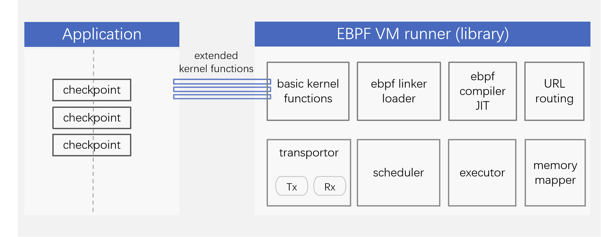

# CTinspector

#### 介绍
CTinspector是天翼云公司自主创新研发基于ebpf指令集的语言虚拟机运行框架。
基于CTinspector运行框架可以快速拓展其应用实例用于诊断网络性能瓶颈点，诊断存储IO处理
的热点和负载均衡等，提高系统运行时诊断的稳定性和时效性。

#### 软件架构

#### 安装教程

1.  编译安装框架  
    mkdir build   
    cd build  
    make  
    make install  
    
2.  编译安装运行实例  
    cd ebpf_example  
    make   
    

#### 使用说明

以运行migrate实例为例： 

1.  Node1上运行  
 ./ebpf vm test/vm test -a 192.168.18.206 -p 1881 -d rxe_0 -i 1 -5 4096  
2.  Node2上运行  
 ./ebpf vm test/vm test -a 192.168.18.208 -p 1881 -d rxe_0 -i 1 -s 4096 -r 1287 -g 1 -t 0  

#### 参与贡献

1.  Fork 本仓库 
2.  新建 Feat_xxx 分支  
    git clone https://gitee.com/openeuler/CTinspector.git  
    git checkout -b Feat_xxx  
3.  提交代码  
    git commit -m ""  
    git push origin   
4.  新建 Pull Request

#### 特技

1.  使用 Readme\_XXX.md 来支持不同的语言，例如 Readme\_en.md, Readme\_zh.md
2.  Gitee 官方博客 [blog.gitee.com](https://blog.gitee.com)
3.  你可以 [https://gitee.com/explore](https://gitee.com/explore) 这个地址来了解 Gitee 上的优秀开源项目
4.  [GVP](https://gitee.com/gvp) 全称是 Gitee 最有价值开源项目，是综合评定出的优秀开源项目
5.  Gitee 官方提供的使用手册 [https://gitee.com/help](https://gitee.com/help)
6.  Gitee 封面人物是一档用来展示 Gitee 会员风采的栏目 [https://gitee.com/gitee-stars/](https://gitee.com/gitee-stars/)
